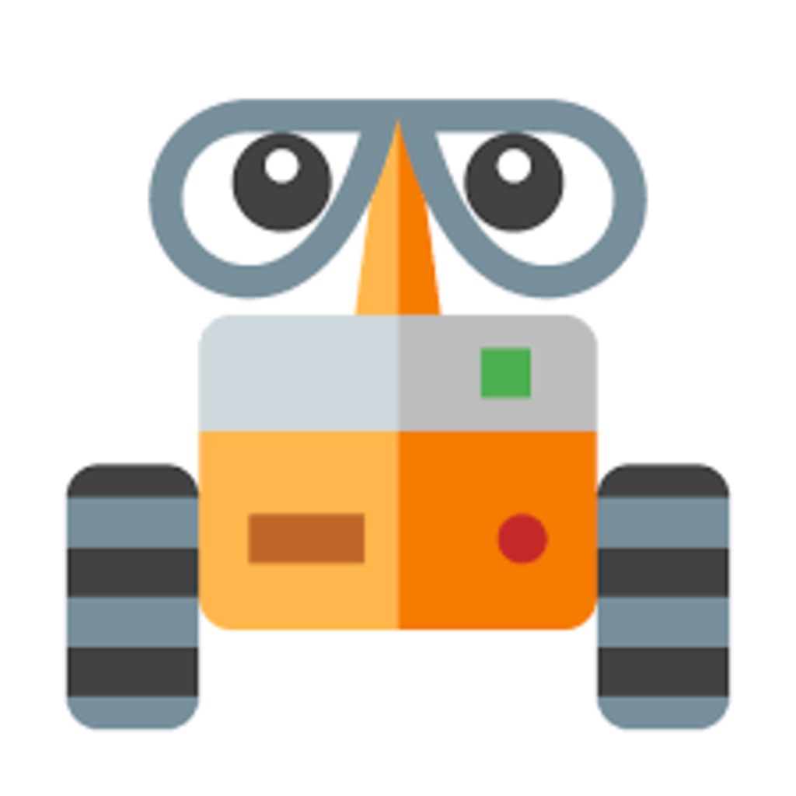

# RC Car Controller - Flutter Mobile Application

<div align="center">



**A professional Bluetooth-controlled RC car application with multiple autonomous modes**

[](https://flutter.dev)
[](https://dart.dev)
[](https://www.android.com)

**Developed by Eng. Gemy**
</div>

---

## 📱 About

RC Car Controller is a Flutter-based mobile application designed to control an RC car via Bluetooth. The app supports four different operating modes including manual control, obstacle avoidance, line following, and maze solving. Built with a modern, intuitive UI and real-time communication with ESP32 microcontroller.

---

## ✨ Features

### 🎮 **Four Operating Modes**

1. **MODE 1 - Manual Control**
   - Touch-based directional control (Forward, Backward, Left, Right)
   - Instant stop on button release (safety feature)
   - Real-time command feedback

2. **MODE 2 - Obstacle Avoidance**
   - Autonomous navigation using ultrasonic sensors
   - Automatic obstacle detection and avoidance
   - No user input required

3. **MODE 3 - Line Follower**
   - Tracks black line paths using IR sensors
   - Autonomous path following
   - Ideal for maze navigation

4. **MODE 4 - Maze Solver**
   - Finds shortest path through maze
   - Complete autonomous operation

### 📡 **Connectivity**
- Bluetooth Serial communication with ESP32
- Real-time command transmission
- Connection status monitoring
- Auto-reconnect support
- Command acknowledgment system

### 🎨 **User Interface**
- Beautiful gradient-based dark theme
- Animated splash screen (5 seconds)
- Intuitive touch controls
- Real-time status display
- Mode-specific color coding
- Connection status indicator

### 🔒 **Safety Features**
- Auto-stop on button release
- Mode buttons prevent duplicate commands
- Connection status validation
- Emergency stop button

---

## 📸 Screenshots

### 1. Splash Screen (Start Screen)
<div align="center">

<p align="center">
  
</p>


**5-Second Animated Introduction**

- App logo with animation
- "RC CAR CONTROLLER" title with gradient effect
- "Eng. Gemy" developer signature
- Loading indicator
- Auto-transitions to home screen

</div>

---

### 2. Home Screen - Permission Request
<div align="center">

<p align="center">
  
</p>


**Initial Bluetooth Permissions**

- Request for Bluetooth access
- Request for location services (required for Bluetooth scanning)
- Connection button visible
- All mode buttons disabled (not connected)
- Status: "Disconnected"
- OFFLINE indicator (red)

</div>

---

### 3. IDLE Mode - Disconnected
<div align="center">

<p align="center">
  
</p>

**Default IDLE State**

Features shown:
- **Header**: Logo + "RC CAR" title + "By Eng. Gemy"
- **Status Indicator**: 🔴 OFFLINE (red)
- **Connect Button**: Blue "CONNECT BLUETOOTH" button
- **Mode Buttons**: 
  - ✅ IDLE (active/selected - gray with glow)
  - ⚫ MODE1 (disabled - dimmed)
  - ⚫ MODE2 (disabled - dimmed)
  - ⚫ MODE3 (disabled - dimmed)
  - ⚫ MODE4 (disabled - dimmed)
- **Direction Buttons**: All dimmed/disabled (30% opacity)
- **Status Bar**: "💤 IDLE - System on Standby"
User cannot:
- Select any mode except IDLE
- Use direction controls
- Send commands to car

</div>

---


### 4. Connecting to Bluetooth
<div align="center">

<p align="center">
  
  
</p>


**Bluetooth Connection Dialog**

Shows:
- **Dialog Title**: "Select Device" with Bluetooth icon
- **Device List**: 
  - Device Name: "RC_Car_ESP32"
  - "CONNECT" button for each device
- **Loading indicator** (when connecting)
- **Progress dialog**: "Connecting to RC_Car_ESP32..."
- Background dimmed

Connection process:
1. User taps "CONNECT BLUETOOTH"
2. Dialog shows paired devices
3. User selects "RC_Car_ESP32"
4. Loading dialog appears
5. Shows "Attempting connection... This may take up to 10 seconds"

</div>

---

### 5. Connected - IDLE Mode Active
<div align="center">

<p align="center">
  
</p>

**Successfully Connected State**

Changes after connection:
- **Status Indicator**: 🟢 ONLINE (green)
- **Connect Button**: Changes to red "DISCONNECT" button
- **Mode Buttons**: 
  - IDLE: Selected (gray with glow)
  - MODE1: Enabled (can be selected)
  - MODE2: Enabled (can be selected)
  - MODE3: Enabled (can be selected)
  - MODE4: Enabled (can be selected)
- **Direction Buttons**: Still disabled (need MODE1)
- **Status Bar**: "💤 IDLE - System on Standby"
- **Success Snackbar**: "✓ Connected to RC_Car_ESP32!"

</div>

---

### 6. MODE 1 - Manual Control (All Directions)
<div align="center">

<p align="center">
  
</p>

**Manual Control Mode**

MODE1 selected:
- **Mode Button**: MODE1 highlighted in blue with glow effect
- **Status**: "🎮 Manual Control - Touch to Drive"
- **Direction Buttons**: All ENABLED (full opacity, glowing)
  - ⬆️ FORWARD (blue gradient)
  - ⬇️ BACKWARD (blue gradient)
  - ⬅️ LEFT (blue gradient)
  - ➡️ RIGHT (blue gradient)
  - ⏹️ STOP (red gradient, center)

Button behavior:
- Hold FORWARD → Status shows "⬆️ Moving Forward"
- Release → Status shows "⏹️ Stopped"
- All buttons have glow effect
- Touch feedback on press

</div>

---

### 7. MODE 2 - Obstacle Avoidance
<div align="center">

<p align="center">
  
</p>

**Autonomous Obstacle Avoidance**

MODE2 selected:
- **Mode Button**: MODE2 highlighted in green with glow
- **Status**: "🛡️ Obstacle Avoidance - Auto Navigation"
- **Direction Buttons**: DISABLED (dimmed to 30%)
  - Cannot manually control in autonomous mode
- **Mode indicator**: Green glow effect
- **ESP32 feedback** shown in status:
  - "STATUS: Obstacle Avoidance Active"
  - "UART1: Sensor: Clear"
  - "UART2: Distance: 50cm"

Features:
- Car operates autonomously
- Ultrasonic sensor data displayed
- Manual control locked
- Can switch to other modes or IDLE

</div>

---

### 8. MODE 3 - Line Follower
<div align="center">

<p align="center">
  
</p>

**Autonomous Line Following**

MODE3 selected:
- **Mode Button**: MODE3 highlighted in orange with glow
- **Status**: "📏 Line Follower - Tracking Path"
- **Direction Buttons**: DISABLED (dimmed)
- **Mode indicator**: Orange glow effect
- **ESP32 feedback**:
  - "STATUS: Line Follower Active"
  - "UART1: IR Sensors: Online"
  - "UART2: Following Line"

Features:
- Tracks black line on white surface
- IR sensor feedback displayed
- Autonomous operation
- Override with IDLE or MODE1

</div>

---

### 9. MODE 4 - Maze Solver
<div align="center">


<p align="center">
  
</p>

**Autonomous Maze Navigation**

MODE4 selected:
- **Mode Button**: MODE4 highlighted in purple with glow
- **Status**: "🧩 Maze Solver - Finding Path"
- **Direction Buttons**: DISABLED (dimmed)
- **Mode indicator**: Purple glow effect
- **ESP32 feedback**:
  - "STATUS: Maze Solver Active"
  - "UART1: Wall detected: Right"
  - "UART2: Path: Forward"

Features:
- Autonomous maze navigation
- Pathfinding algorithm active
- Real-time decision feedback
- Emergency stop available via IDLE

</div>

---

## 📊 Screenshot Comparison Table

| State | Status LED | Connect Button | Mode Buttons | Direction Buttons | Status Message |
|-------|-----------|----------------|--------------|-------------------|----------------|
| **Splash** | N/A | N/A | N/A | N/A | "Initializing..." |
| **Permission Request** | 🔴 OFFLINE | Blue "CONNECT" | All dimmed | All dimmed | "Disconnected" |
| **IDLE (Disconnected)** | 🔴 OFFLINE | Blue "CONNECT" | Only IDLE enabled | All dimmed | "💤 IDLE - System on Standby" |
| **Offline** | 🔴 OFFLINE | Blue "CONNECT" | All dimmed | All dimmed | "🔴 Disconnected" |
| **Connecting** | 🔴 OFFLINE | Disabled | Dialog open | All dimmed | Loading dialog |
| **Connected (IDLE)** | 🟢 ONLINE | Red "DISCONNECT" | All enabled, IDLE selected | All dimmed | "💤 IDLE - System on Standby" |
| **MODE1** | 🟢 ONLINE | Red "DISCONNECT" | MODE1 selected (blue) | All ENABLED | "🎮 Manual Control - Touch to Drive" |
| **MODE2** | 🟢 ONLINE | Red "DISCONNECT" | MODE2 selected (green) | All dimmed | "🛡️ Obstacle Avoidance - Auto Navigation" |
| **MODE3** | 🟢 ONLINE | Red "DISCONNECT" | MODE3 selected (orange) | All dimmed | "📏 Line Follower - Tracking Path" |
| **MODE4** | 🟢 ONLINE | Red "DISCONNECT" | MODE4 selected (purple) | All dimmed | "🧩 Maze Solver - Finding Path" |

---

## 🎨 UI Color Scheme

### Mode Colors
```
IDLE:   Gray (#9E9E9E)
MODE1:  Blue (#42A5F5)
MODE2:  Green (#66BB6A)
MODE3:  Orange (#FFA726)
MODE4:  Purple (#AB47BC)
```

### Status Colors
```
ONLINE:       Green (#4CAF50)
OFFLINE:      Red (#F44336)
Direction:    Blue (#1976D2)
Stop:         Red (#EF5350)
Background:   Dark (#0a0e27, #1a1f3a)
```

## 🔧 Requirements

### Software Requirements

- **Flutter SDK**: 3.0.0 or higher
- **Dart SDK**: 3.0.0 or higher
- **Android Studio** or **VS Code** with Flutter extensions
- **Android SDK**: API Level 21+ (Android 5.0 Lollipop)

### Dependencies

```yaml
dependencies:
  flutter_bluetooth_serial: ^0.4.0
  permission_handler: ^12.0.1

dev_dependencies:
  flutter_launcher_icons: ^0.13.1
```

---

## 🛠️ Troubleshooting

### Connection Issues

**Problem**: Can't find "RC_Car_ESP32" in device list

**Solutions**:
- Ensure ESP32 is powered on
- Check ESP32 LED is blinking (heartbeat)
- Verify ESP32 code is uploaded correctly
- Check Bluetooth is enabled on phone
- Grant location permissions to app

---

**Problem**: Connection fails/timeout

**Solutions**:
- Restart ESP32
- Unpair and re-pair device in Android settings
- Move closer to ESP32 (within 10 meters)
- Ensure no other device is connected to ESP32
- Check Serial Monitor for ESP32 errors

---

### Control Issues

**Problem**: Direction buttons don't work

**Solutions**:
- Verify you're in **MODE1** (manual control)
- Check connection status is **ONLINE**
- Test with Serial Bluetooth Terminal app
- Verify UART connections to motor controllers

---

**Problem**: Mode buttons not responding

**Solutions**:
- Ensure Bluetooth is connected
- Mode buttons only send command once (prevent duplicates)
- Switch to different mode to re-enable
- Check ESP32 Serial Monitor for received commands

---

### App Issues

**Problem**: App crashes on startup

**Solutions**:
- Check Android version (minimum 5.0)
- Grant all permissions (Bluetooth, Location)
- Reinstall app
- Clear app data in Settings

---

**Problem**: Status monitor shows nothing

**Solutions**:
- ESP32 must send responses with `\n` terminator
- Check Bluetooth connection is active
- Verify ESP32 code sends acknowledgments
- Test with `flutter run` to see console logs

---

## 📁 Project Structure

```
rc_car_controller/
|
├── assets/
│   └── images/
│       └── logo.png            # App logo
├── lib/
│   ├── main.dart               # App entry point
│   ├── splash_screen.dart      # Splash screen (5 sec)
│   ├── control_screen.dart     # Main control UI
│   └── bluetooth_manager.dart  # Bluetooth logic
└──  pubspec.yaml               # Flutter dependencies                 
```

---
## 👨‍💻 Author

**Eng. Mohamad Gamal (Eng.Gemy)**\
Embedded Systems Engineer\
📅 Created: 2025\
📍 Faculty of Engineering, Cairo University – ECE Dept.

---
